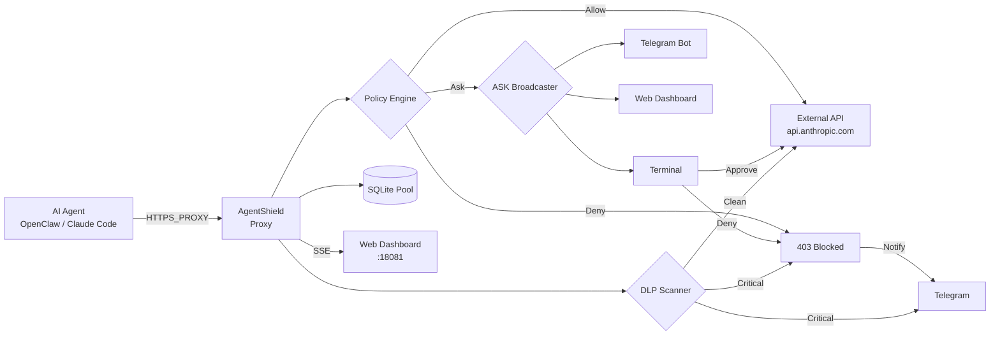

# AgentShield

**Default-deny egress control for AI agents.**

[](LICENSE)
[](https://github.com/kamuimk/agentshield/actions/workflows/ci.yml)
[](https://codecov.io/gh/kamuimk/agentshield)

AgentShield is a transparent egress firewall for AI agents (OpenClaw, Claude Code, etc.). It intercepts all outbound HTTP/HTTPS traffic and enforces TOML-based policy rules — blocking unauthorized requests before they leave your machine.

## Architecture



## Quick Start

```bash
# Build from source (requires Rust 1.85+)
git clone https://github.com/kamuimk/agentshield.git
cd agentshield
cargo build --release

# Initialize
./target/release/agentshield init

# Apply a policy template
./target/release/agentshield policy template openclaw-default

# Start the proxy
./target/release/agentshield start

# Point your AI agent to the proxy
export HTTPS_PROXY=http://127.0.0.1:18080
```

### Integrate with OpenClaw (Node.js)

For OpenClaw or other Node.js-based agents, use the built-in integration command:

```bash
# Auto-configure OpenClaw to use AgentShield proxy
agentshield integrate openclaw

# Remove the proxy configuration
agentshield integrate remove
```

This sets `channels.telegram.proxy` in `~/.openclaw/openclaw.json` to route traffic through AgentShield.

## Policy Configuration

Policies are defined in `agentshield.toml`:

```toml
[proxy]
listen = "127.0.0.1:18080"
mode = "transparent"

[policy]
default = "deny"    # deny | allow | ask

# Allow LLM API calls (wildcard: *.anthropic.com matches all subdomains)
[[policy.rules]]
name = "anthropic-api"
domains = ["*.anthropic.com"]
action = "allow"

# Allow GitHub reads, require approval for writes
[[policy.rules]]
name = "github-read"
domains = ["api.github.com"]
methods = ["GET"]
action = "allow"

[[policy.rules]]
name = "github-write"
domains = ["api.github.com"]
methods = ["POST", "PUT", "PATCH", "DELETE"]
action = "ask"

# Enable DLP scanning on HTTP requests
[dlp]
enabled = true
# patterns = ["openai-api-key", "aws-access-key"]  # optional: subset of built-in patterns

# System allowlist: bypass policy for internal services (e.g., notification endpoints)
# [system]
# allowlist = ["api.telegram.org"]

# Notifications: receive Telegram alerts on deny/DLP events
# [notification]
# enabled = true
# [notification.telegram]
# bot_token = "${AGENTSHIELD_TELEGRAM_TOKEN}"
# chat_id = "${AGENTSHIELD_TELEGRAM_CHAT_ID}"
# events = ["deny", "dlp"]

# Web dashboard: real-time logs, policy editor, ASK approval
[web]
enabled = true
listen = "127.0.0.1:18081"
```

### Policy Actions

| Action | Behavior |
|--------|----------|
| `allow` | Request passes through, logged to SQLite |
| `deny` | Request blocked with `403 Forbidden` + `X-AgentShield-Reason` header |
| `ask` | Terminal prompt for approval with payload inspection. Timeout (30s) defaults to deny |

### Interactive ASK Prompt

When a request matches an `ask` rule, AgentShield displays a terminal prompt with four options:

| Key | Action |
|-----|--------|
| `a` | **Allow once** — permit this single request |
| `r` | **Add rule** — auto-generate a permanent allow rule in the config file |
| `d` | **Deny** — block the request |
| `i` | **Inspect** — view the request payload (truncated at 4KB) before deciding |

Unknown input defaults to deny (fail-closed). An `AskPending` notification is sent to Telegram before the prompt appears.

ASK requests are broadcast to all enabled channels simultaneously (Terminal, Telegram, Web Dashboard). The first response from any channel is applied.

### Wildcard Domain Matching

Domain patterns support wildcards:

| Pattern | Matches | Does NOT Match |
|---------|---------|----------------|
| `api.github.com` | `api.github.com` | `sub.api.github.com` |
| `*.github.com` | `api.github.com`, `github.com`, `deep.api.github.com` | `evil-github.com` |
| `*` | Everything | — |

Wildcards work in both `[[policy.rules]]` domains and `[system] allowlist`.

### Environment Variable Substitution

Use `${VAR_NAME}` or `$VAR_NAME` syntax in `agentshield.toml` to reference environment variables. This keeps secrets out of the config file:

```toml
[notification.telegram]
bot_token = "${AGENTSHIELD_TELEGRAM_TOKEN}"
chat_id = "${AGENTSHIELD_TELEGRAM_CHAT_ID}"
```

Missing variables produce a clear error message at startup.

### System Allowlist

Domains in `[system] allowlist` bypass policy evaluation **and** DLP scanning entirely. This prevents the proxy from blocking its own notification traffic.

```toml
[system]
allowlist = ["api.telegram.org"]
```

> **Security Warning:** Allowlisted domains bypass **all** protection (policy + DLP). Only add trusted internal services. Adding external domains disables outbound protection for that destination.

### Notifications

AgentShield can send alerts to Telegram when requests are denied or DLP findings occur. Notifications are fire-and-forget — failures never block the proxy.

```toml
[notification]
enabled = true

[notification.telegram]
bot_token = "${AGENTSHIELD_TELEGRAM_TOKEN}"
chat_id = "${AGENTSHIELD_TELEGRAM_CHAT_ID}"
events = ["deny", "dlp"]
```

The `events` field filters which event types trigger a notification:

| Event Type | Description |
|------------|-------------|
| `deny` | Request blocked by policy |
| `dlp` | DLP scanner detected sensitive data |
| `ask` | Request pending interactive approval |
| `start` | Proxy server started |
| `shutdown` | Proxy server shutting down |

If `events` is empty or omitted, all event types are forwarded (backward compatible).

#### Interactive Telegram ASK

Enable bidirectional ASK approval via Telegram inline keyboard:

```toml
[notification.telegram]
bot_token = "${AGENTSHIELD_TELEGRAM_TOKEN}"
chat_id = "${AGENTSHIELD_TELEGRAM_CHAT_ID}"
interactive = true  # Enable inline keyboard for ASK approval
```

When `interactive = true`, ASK requests appear as Telegram messages with Allow/Deny buttons. The first response from any channel (Terminal, Telegram, or Web Dashboard) wins.

### Web Dashboard

AgentShield includes a built-in web dashboard for real-time monitoring and ASK approval:

```toml
[web]
enabled = true
listen = "127.0.0.1:18081"  # default
```

Open `http://127.0.0.1:18081` in your browser to access:

- **Live Logs** — real-time request stream via Server-Sent Events (SSE)
- **Statistics** — total, allowed, denied, asked, system-allowed counts
- **Policy Editor** — view and edit policy rules as JSON
- **ASK Approval** — approve or deny pending ASK requests from the browser

#### REST API Endpoints

| Method | Path | Description |
|--------|------|-------------|
| `GET` | `/api/logs?limit=50` | Recent request logs |
| `GET` | `/api/logs/stream` | SSE real-time log stream |
| `GET` | `/api/status` | Request statistics |
| `GET` | `/api/policy` | Current policy (JSON) |
| `PUT` | `/api/policy` | Update policy rules |
| `GET` | `/api/ask/pending` | Pending ASK requests |
| `GET` | `/api/ask/stream` | SSE ASK event stream |
| `POST` | `/api/ask/:id/allow` | Approve a pending ASK |
| `POST` | `/api/ask/:id/deny` | Deny a pending ASK |

### Policy Hot-Reload

Policy rules reload automatically without restarting the proxy:

- **File watcher** — changes to `agentshield.toml` are detected and applied instantly
- **SIGHUP signal** — send `kill -HUP <pid>` to trigger a manual reload

Invalid configuration changes are safely ignored (the previous policy remains active).

### DLP (Data Loss Prevention)

When `[dlp] enabled = true`, AgentShield scans HTTP request bodies for sensitive data before forwarding:

| Severity | Patterns | Action |
|----------|----------|--------|
| Critical | OpenAI, Anthropic, Google AI, HuggingFace, Cohere, Replicate, Mistral, Groq, Together AI, Fireworks AI API keys, AWS access key, private key, GitHub token | Block (403) |
| High | Generic API key | Log warning, allow |
| Medium | Email address | Log warning, allow |

> **Note:** CONNECT tunnels (HTTPS) are encrypted and cannot be scanned by DLP.

### Built-in Templates

| Template | Description |
|----------|-------------|
| `openclaw-default` | OpenClaw Gateway defaults: LLM APIs, messaging, GitHub, npm |
| `claude-code-default` | Claude Code defaults |
| `strict` | Deny all traffic (blank slate) |

```bash
agentshield policy template openclaw-default
```

## CLI Commands

```
agentshield init                      # Initialize config + database
agentshield start [--daemon]          # Start the proxy
agentshield stop                      # Stop the proxy
agentshield status                    # Show request statistics
agentshield logs [--tail N]           # View recent logs
agentshield logs --export --format json  # Export logs
agentshield policy show               # Display current policy
agentshield policy template <name>    # Apply a template
agentshield integrate openclaw        # Configure OpenClaw to use proxy
agentshield integrate remove          # Remove proxy configuration
```

## Using with Docker (OpenClaw)

If your AI agent runs in Docker, set proxy environment variables:

```yaml
# docker-compose.yml
services:
  openclaw-gateway:
    environment:
      HTTP_PROXY: http://host.docker.internal:18080
      HTTPS_PROXY: http://host.docker.internal:18080
      NO_PROXY: localhost,127.0.0.1
```

Make sure AgentShield listens on `0.0.0.0:18080` (not `127.0.0.1`) for Docker access.

> **Note:** Node.js 23 does not natively support `HTTP_PROXY` / `HTTPS_PROXY` environment variables. You may need to use a proxy agent library (e.g., `undici`) or wait for Node.js 24+ with `NODE_USE_ENV_PROXY=1` support.

## What AgentShield is NOT

- **Not a sandbox.** AgentShield controls network egress only. It does not restrict file system access, process execution, or other local operations.
- **Not a prompt injection defense.** It operates at the network layer, not the LLM layer.
- **Not a WAF.** It's an egress firewall, not an ingress firewall. It protects against data exfiltration, not against incoming attacks.

AgentShield complements tools like [PipeLock](https://github.com/nichochar/pipelock) (code execution sandboxing) and [LlamaFirewall](https://github.com/meta-llama/PurpleLlama) (prompt-level defense).

## Development

- **MSRV:** Rust 1.85 (edition 2024)

```bash
cargo test --all     # Run all tests (219 tests)
cargo clippy         # Lint
cargo fmt            # Format
```

## License

[Apache License 2.0](LICENSE)
