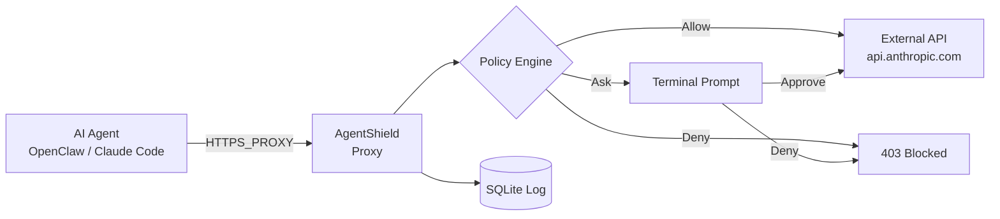

# AgentShield

**Default-deny egress control for AI agents.**

[](LICENSE)
[](https://github.com/kamuimk/agentshield/actions/workflows/ci.yml)

AgentShield is a transparent egress firewall for AI agents (OpenClaw, Claude Code, etc.). It intercepts all outbound HTTP/HTTPS traffic and enforces TOML-based policy rules — blocking unauthorized requests before they leave your machine.

## Architecture



## Quick Start

```bash
# Build from source
git clone https://github.com/kamuimk/agentshield.git
cd agentshield
cargo build --release

# Initialize
./target/release/agentshield init

# Apply a policy template
./target/release/agentshield policy template openclaw-default

# Start the proxy
./target/release/agentshield start

# Point your AI agent to the proxy
export HTTPS_PROXY=http://127.0.0.1:18080
```

## Policy Configuration

Policies are defined in `agentshield.toml`:

```toml
[proxy]
listen = "127.0.0.1:18080"
mode = "transparent"

[policy]
default = "deny"    # deny | allow | ask

# Allow LLM API calls
[[policy.rules]]
name = "anthropic-api"
domains = ["api.anthropic.com"]
action = "allow"

# Allow GitHub reads, require approval for writes
[[policy.rules]]
name = "github-read"
domains = ["api.github.com"]
methods = ["GET"]
action = "allow"

[[policy.rules]]
name = "github-write"
domains = ["api.github.com"]
methods = ["POST", "PUT", "PATCH", "DELETE"]
action = "ask"
```

### Policy Actions

| Action | Behavior |
|--------|----------|
| `allow` | Request passes through, logged to SQLite |
| `deny` | Request blocked with `403 Forbidden` + `X-AgentShield-Reason` header |
| `ask` | Terminal prompt for approval. Timeout (30s) defaults to deny |

### Built-in Templates

| Template | Description |
|----------|-------------|
| `openclaw-default` | OpenClaw Gateway defaults: LLM APIs, messaging, GitHub, npm |
| `claude-code-default` | Claude Code defaults |
| `strict` | Deny all traffic (blank slate) |

```bash
agentshield policy template openclaw-default
```

## CLI Commands

```
agentshield init                      # Initialize config + database
agentshield start [--daemon]          # Start the proxy
agentshield stop                      # Stop the proxy
agentshield status                    # Show request statistics
agentshield logs [--tail N]           # View recent logs
agentshield logs --export --format json  # Export logs
agentshield policy show               # Display current policy
agentshield policy template <name>    # Apply a template
```

## Using with Docker (OpenClaw)

If your AI agent runs in Docker, set proxy environment variables:

```yaml
# docker-compose.yml
services:
  openclaw-gateway:
    environment:
      HTTP_PROXY: http://host.docker.internal:18080
      HTTPS_PROXY: http://host.docker.internal:18080
      NO_PROXY: localhost,127.0.0.1
```

Make sure AgentShield listens on `0.0.0.0:18080` (not `127.0.0.1`) for Docker access.

## What AgentShield is NOT

- **Not a sandbox.** AgentShield controls network egress only. It does not restrict file system access, process execution, or other local operations.
- **Not a prompt injection defense.** It operates at the network layer, not the LLM layer.
- **Not a WAF.** It's an egress firewall, not an ingress firewall. It protects against data exfiltration, not against incoming attacks.

AgentShield complements tools like [PipeLock](https://github.com/nichochar/pipelock) (code execution sandboxing) and [LlamaFirewall](https://github.com/meta-llama/PurpleLlama) (prompt-level defense).

## Development

```bash
cargo test          # Run all tests (61 tests)
cargo clippy        # Lint
cargo fmt           # Format
```

## License

[Apache License 2.0](LICENSE)
