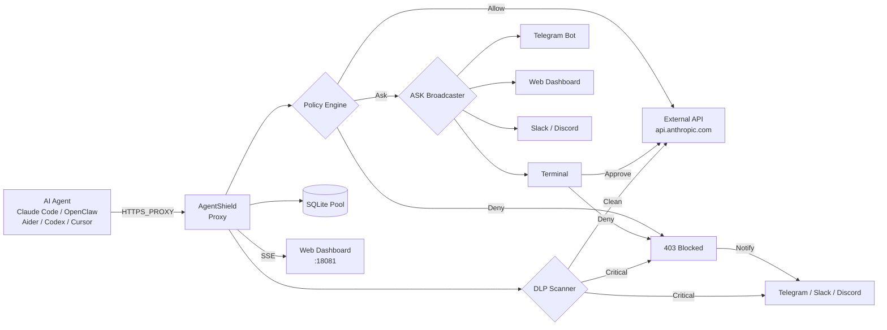

# AgentShield

**Default-deny egress control for AI agents.**

[](LICENSE)
[](https://github.com/kamuimk/agentshield/actions/workflows/ci.yml)
[](https://codecov.io/gh/kamuimk/agentshield)

**[한국어 문서 (Korean)](docs/README.ko.md)**

AgentShield is a transparent egress firewall for AI agents (OpenClaw, Claude Code, etc.). It intercepts all outbound HTTP/HTTPS traffic and enforces TOML-based policy rules — blocking unauthorized requests before they leave your machine. In MITM mode, it can decrypt HTTPS connections to perform DLP scanning on encrypted payloads.

## Architecture


```mermaid
flowchart LR
    A[AI Agent<br/>Claude Code / OpenClaw<br/>Aider / Codex / Cursor] -->|HTTPS_PROXY| B[AgentShield<br/>Proxy]
    B --> C{Policy Engine}
    C -->|Allow| D[External API<br/>api.anthropic.com]
    C -->|Deny| E[403 Blocked]
    C -->|Ask| F{ASK Broadcaster}
    F --> F1[Terminal]
    F --> F2[Telegram Bot]
    F --> F3[Web Dashboard]
    F --> F4[Slack / Discord]
    F1 -->|Approve| D
    F1 -->|Deny| E
    B --> G[(SQLite Pool)]
    B --> H{DLP Scanner}
    H -->|Critical| E
    H -->|Clean| D
    E -->|Notify| I[Telegram / Slack / Discord]
    H -->|Critical| I
    B -->|SSE| J[Web Dashboard<br/>:18081]
```

## Installation

```bash
# One-line install (macOS / Linux)
curl -fsSL https://raw.githubusercontent.com/kamuimk/agentshield/main/install.sh | sh

# Homebrew (macOS / Linux)
brew install kamuimk/tap/agentshield

# Build from source (requires Rust 1.85+)
git clone https://github.com/kamuimk/agentshield.git && cd agentshield
cargo build --release
```

## Quick Start

The fastest way to get started — a single command that launches the proxy and wraps your agent:

```bash
# Interactive setup wizard
agentshield quickstart

# Or wrap any agent in one line
agentshield wrap -- claude
agentshield wrap -- aider
agentshield wrap --mitm --dashboard -- codex
```

### Manual Setup

```bash
agentshield init                              # Initialize config + database
agentshield policy template claude-code-default  # Apply a template
agentshield start                              # Start the proxy
export HTTPS_PROXY=http://127.0.0.1:18080      # Point your agent to the proxy
```

### Integrate with AI Agents

Use built-in integration commands to configure your agent:

```bash
# OpenClaw (Node.js)
agentshield integrate openclaw
agentshield integrate remove

# Claude Code
agentshield integrate claude-code
agentshield integrate claude-code --ca-cert ~/.agentshield/ca/cert.pem  # MITM mode
agentshield integrate remove-claude-code
```

- **OpenClaw**: Sets `channels.telegram.proxy` in `~/.openclaw/openclaw.json`
- **Claude Code**: Sets `HTTPS_PROXY`/`HTTP_PROXY` (and optionally `NODE_EXTRA_CA_CERTS`) in `~/.claude/settings.json`

## Policy Configuration

Policies are defined in `agentshield.toml`:

```toml
[proxy]
listen = "127.0.0.1:18080"
mode = "transparent"

[policy]
default = "deny"    # deny | allow | ask

# Allow LLM API calls (wildcard: *.anthropic.com matches all subdomains)
[[policy.rules]]
name = "anthropic-api"
domains = ["*.anthropic.com"]
action = "allow"

# Allow GitHub reads, require approval for writes
[[policy.rules]]
name = "github-read"
domains = ["api.github.com"]
methods = ["GET"]
action = "allow"

[[policy.rules]]
name = "github-write"
domains = ["api.github.com"]
methods = ["POST", "PUT", "PATCH", "DELETE"]
action = "ask"

# Rate limit: max 100 requests per 60 seconds
[[policy.rules]]
name = "rate-limited-api"
domains = ["api.example.com"]
action = "allow"
[policy.rules.rate_limit]
max_requests = 100
window_secs = 60

# Enable DLP scanning on HTTP requests
[dlp]
enabled = true
# patterns = ["openai-api-key", "aws-access-key"]  # optional: subset of built-in patterns

# System allowlist: bypass policy for internal services (e.g., notification endpoints)
# [system]
# allowlist = ["api.telegram.org"]

# Notifications: receive Telegram alerts on deny/DLP events
# [notification]
# enabled = true
# [notification.telegram]
# bot_token = "${AGENTSHIELD_TELEGRAM_TOKEN}"
# chat_id = "${AGENTSHIELD_TELEGRAM_CHAT_ID}"
# events = ["deny", "dlp"]

# Web dashboard: real-time logs, policy editor, ASK approval
[web]
enabled = true
listen = "127.0.0.1:18081"
```

### Policy Actions

| Action | Behavior |
|--------|----------|
| `allow` | Request passes through, logged to SQLite |
| `deny` | Request blocked with `403 Forbidden` + `X-AgentShield-Reason` header |
| `ask` | Terminal prompt for approval with payload inspection. Timeout (30s) defaults to deny |
| `allow` + `rate_limit` | Allowed up to the configured limit; excess requests blocked with `429 Too Many Requests` |

### Interactive ASK Prompt

When a request matches an `ask` rule, AgentShield displays a terminal prompt with four options:

| Key | Action |
|-----|--------|
| `a` | **Allow once** — permit this single request |
| `r` | **Add rule** — auto-generate a permanent allow rule in the config file |
| `d` | **Deny** — block the request |
| `i` | **Inspect** — view the request payload (truncated at 4KB) before deciding |

Unknown input defaults to deny (fail-closed). An `AskPending` notification is sent to Telegram before the prompt appears.

ASK requests are broadcast to all enabled channels simultaneously (Terminal, Telegram, Web Dashboard). The first response from any channel is applied.

### Wildcard Domain Matching

Domain patterns support wildcards:

| Pattern | Matches | Does NOT Match |
|---------|---------|----------------|
| `api.github.com` | `api.github.com` | `sub.api.github.com` |
| `*.github.com` | `api.github.com`, `github.com`, `deep.api.github.com` | `evil-github.com` |
| `*` | Everything | — |

Wildcards work in both `[[policy.rules]]` domains and `[system] allowlist`.

### Environment Variable Substitution

Use `${VAR_NAME}` or `$VAR_NAME` syntax in `agentshield.toml` to reference environment variables. This keeps secrets out of the config file:

```toml
[notification.telegram]
bot_token = "${AGENTSHIELD_TELEGRAM_TOKEN}"
chat_id = "${AGENTSHIELD_TELEGRAM_CHAT_ID}"
```

Missing variables produce a clear error message at startup.

### System Allowlist

Domains in `[system] allowlist` bypass policy evaluation **and** DLP scanning entirely. This prevents the proxy from blocking its own notification traffic.

```toml
[system]
allowlist = ["api.telegram.org"]
```

> **Security Warning:** Allowlisted domains bypass **all** protection (policy + DLP). Only add trusted internal services. Adding external domains disables outbound protection for that destination.

### Notifications

AgentShield sends alerts via Telegram, Slack, and/or Discord when requests are denied or DLP findings occur. Multiple backends can be enabled simultaneously. Notifications are fire-and-forget — failures never block the proxy.

```toml
[notification]
enabled = true

# Telegram
[notification.telegram]
bot_token = "${AGENTSHIELD_TELEGRAM_TOKEN}"
chat_id = "${AGENTSHIELD_TELEGRAM_CHAT_ID}"
events = ["deny", "dlp"]

# Slack (Incoming Webhook)
[notification.slack]
webhook_url = "${AGENTSHIELD_SLACK_WEBHOOK}"
events = ["deny", "dlp"]

# Discord (Webhook or Bot)
[notification.discord]
webhook_url = "${AGENTSHIELD_DISCORD_WEBHOOK}"
events = ["deny", "dlp"]
```

The `events` field filters which event types trigger a notification:

| Event Type | Description |
|------------|-------------|
| `deny` | Request blocked by policy |
| `dlp` | DLP scanner detected sensitive data |
| `ask` | Request pending interactive approval |
| `rate-limited` | Request blocked by rate limiter |
| `start` | Proxy server started |
| `shutdown` | Proxy server shutting down |

If `events` is empty or omitted, all event types are forwarded (backward compatible).

#### Interactive ASK via Telegram / Discord

Enable bidirectional ASK approval via inline buttons:

```toml
# Telegram inline keyboard
[notification.telegram]
bot_token = "${AGENTSHIELD_TELEGRAM_TOKEN}"
chat_id = "${AGENTSHIELD_TELEGRAM_CHAT_ID}"
interactive = true

# Discord interactive buttons (requires bot_token + channel_id)
[notification.discord]
bot_token = "${AGENTSHIELD_DISCORD_BOT_TOKEN}"
channel_id = "${AGENTSHIELD_DISCORD_CHANNEL_ID}"
interactive = true
```

When `interactive = true`, ASK requests appear as messages with Allow/Deny buttons. The first response from any channel (Terminal, Telegram, Discord, or Web Dashboard) wins.

### Web Dashboard

AgentShield includes a built-in web dashboard for real-time monitoring and ASK approval:

```toml
[web]
enabled = true
listen = "127.0.0.1:18081"  # default
auth_token = "${AGENTSHIELD_WEB_TOKEN}"  # optional: Bearer token for API auth
```

Open `http://127.0.0.1:18081` in your browser (or run `agentshield dashboard`) to access:

- **Live Logs** — real-time request stream via SSE, with domain/action filtering and auto-scroll
- **Statistics** — total, allowed, denied, asked, system-allowed, rate-limited counts
- **Timeline Chart** — per-minute request volume (allowed vs denied) over the last 60 minutes
- **Policy Editor** — view and edit policy rules as JSON
- **ASK Approval** — approve or deny pending ASK requests from the browser
- **Theme Toggle** — dark/light theme with `localStorage` persistence

#### Authentication

When `auth_token` is set, all `/api/*` endpoints require a Bearer token. The dashboard page (`/`) is always public.

```bash
# Via header
curl -H "Authorization: Bearer <token>" http://127.0.0.1:18081/api/status

# Via query parameter (for SSE/EventSource)
curl http://127.0.0.1:18081/api/logs/stream?token=<token>
```

The web frontend shows a token input modal on first visit. The token is stored in `sessionStorage` and sent automatically with all API requests.

#### REST API Endpoints

| Method | Path | Description |
|--------|------|-------------|
| `GET` | `/api/logs?limit=50` | Recent request logs |
| `GET` | `/api/logs/stream` | SSE real-time log stream |
| `GET` | `/api/status` | Request statistics |
| `GET` | `/api/stats/timeline?minutes=60` | Per-minute request timeline |
| `GET` | `/api/policy` | Current policy (JSON) |
| `PUT` | `/api/policy` | Update policy rules |
| `GET` | `/api/ask/pending` | Pending ASK requests |
| `GET` | `/api/ask/stream` | SSE ASK event stream |
| `POST` | `/api/ask/:id/allow` | Approve a pending ASK |
| `POST` | `/api/ask/:id/deny` | Deny a pending ASK |

### MITM Mode (TLS Interception)

MITM mode decrypts HTTPS traffic for DLP scanning. It requires a local Root CA:

```bash
# Generate Root CA
agentshield ca init

# Install CA into system trust store (prints instructions)
agentshield ca trust

# Show certificate fingerprint
agentshield ca show

# Export certificate for other machines
agentshield ca export /path/to/exported.pem
```

Enable MITM in your config:

```toml
[proxy]
listen = "127.0.0.1:18080"
mode = "mitm"
ca_dir = "~/.agentshield/ca"
```

In MITM mode:
- HTTPS CONNECT requests are decrypted, inspected by DLP, then re-encrypted
- System-allowlisted domains bypass MITM (plain tunnel, no decryption)
- Policy-denied domains are blocked before TLS handshake
- Per-domain certificates are dynamically generated and cached (LRU, max 1000)

For Node.js applications, set `NODE_EXTRA_CA_CERTS` to trust the AgentShield CA:

```bash
export NODE_EXTRA_CA_CERTS=~/.agentshield/ca/cert.pem
```

### Policy Hot-Reload

Policy rules reload automatically without restarting the proxy:

- **File watcher** — changes to `agentshield.toml` are detected and applied instantly
- **SIGHUP signal** — send `kill -HUP <pid>` to trigger a manual reload

Invalid configuration changes are safely ignored (the previous policy remains active).

### Rate Limiting

Per-domain sliding window rate limiting prevents excessive API calls:

```toml
[[policy.rules]]
name = "rate-limited-api"
domains = ["api.example.com"]
action = "allow"
[policy.rules.rate_limit]
max_requests = 100    # max requests allowed
window_secs = 60      # time window in seconds
```

When a domain exceeds its limit, the proxy returns `429 Too Many Requests`. Rate-limited requests are logged and counted in `agentshield status`. A `rate-limited` notification event is also emitted.

### DLP (Data Loss Prevention)

When `[dlp] enabled = true`, AgentShield scans HTTP request bodies for sensitive data before forwarding:

| Severity | Patterns | Action |
|----------|----------|--------|
| Critical | OpenAI, Anthropic, Google AI, HuggingFace, Cohere, Replicate, Mistral, Groq, Together AI, Fireworks AI API keys, AWS access key, private key, GitHub token | Block (403) |
| High | Generic API key | Log warning, allow |
| Medium | Email address | Log warning, allow |

> **Note:** In transparent mode, CONNECT tunnels (HTTPS) are encrypted and cannot be scanned by DLP. Use MITM mode to enable DLP on HTTPS traffic.

### Audit Logging

Enable request body capture for forensic analysis:

```toml
[logging]
audit = true
audit_max_body_size = 65536    # max body size in bytes (default: 64KB)
audit_actions = ["deny", "dlp"]  # which actions to audit (empty = all)
```

Audit logs are stored in SQLite and include the request body and DLP findings. Use `agentshield logs --show-body` to view them.

### Log Filtering

Filter logs by domain, action, time range, or free-text search:

```bash
agentshield logs --domain api.github.com
agentshield logs --action deny --since 2025-01-01 --until 2025-01-31
agentshield logs --search "api-key"
```

### Config Validation

Validate your `agentshield.toml` for errors and warnings before starting:

```bash
agentshield validate
agentshield validate --config /path/to/agentshield.toml
```

Checks include: listen address format, MITM CA directory existence, duplicate rule names, empty domains, catch-all wildcards, rate limits on non-allow actions.

### Built-in Templates

| Template | Description |
|----------|-------------|
| `claude-code-default` | Claude Code: Anthropic, GitHub, npm |
| `openclaw-default` | OpenClaw Gateway: LLM APIs, messaging, GitHub, npm |
| `aider-default` | Aider: LLM APIs + GitHub |
| `codex-default` | OpenAI Codex: OpenAI APIs |
| `cursor-default` | Cursor IDE: Anthropic, OpenAI, Cursor servers |
| `development-general` | General development: LLM APIs + GitHub + package registries |
| `minimal-llm` | Minimal: only Anthropic + OpenAI + Google AI |
| `strict` | Deny all traffic (blank slate) |

```bash
agentshield policy template claude-code-default
agentshield policy template --list             # List all available templates
```

### Community Templates

Place custom `.toml` files in `~/.agentshield/templates/` to make them available as templates:

```bash
cp my-custom.toml ~/.agentshield/templates/
agentshield policy template my-custom
```

## CLI Commands

```
agentshield quickstart                # Interactive setup wizard
agentshield wrap -- claude            # Wrap an agent with proxy (one-line)
agentshield wrap --mitm --dashboard -- aider  # With MITM + dashboard
agentshield init                      # Initialize config + database
agentshield start [--daemon]          # Start the proxy
agentshield stop                      # Stop the proxy (graceful shutdown)
agentshield status                    # Show request statistics
agentshield validate                  # Validate config file
agentshield logs [--tail N]           # View recent logs
agentshield logs --domain example.com # Filter by domain
agentshield logs --action deny        # Filter by action
agentshield logs --show-body          # Show audit body/DLP findings
agentshield logs --export --format json  # Export logs
agentshield policy show               # Display current policy
agentshield policy template <name>    # Apply a template
agentshield policy template --list    # List available templates
agentshield integrate openclaw        # Configure OpenClaw to use proxy
agentshield integrate claude-code     # Configure Claude Code to use proxy
agentshield integrate remove          # Remove OpenClaw proxy config
agentshield integrate remove-claude-code  # Remove Claude Code proxy config
agentshield dashboard                 # Open web dashboard in browser
agentshield ca init                   # Generate Root CA for MITM mode
agentshield ca trust                  # Show system trust store instructions
agentshield ca show                   # Display CA certificate info
agentshield ca export <path>          # Export CA certificate
```

## Docker

AgentShield provides a multi-platform Docker image (amd64/arm64):

```bash
# Build locally
docker build -t agentshield .

# Run with config
docker run -v ./agentshield.toml:/etc/agentshield/agentshield.toml \
  -p 18080:18080 -p 18081:18081 \
  agentshield start --config /etc/agentshield/agentshield.toml
```

Pre-built images are published to `ghcr.io` on each tagged release.

### Using with Docker Compose (OpenClaw)

```yaml
# docker-compose.yml
services:
  agentshield:
    image: ghcr.io/kamuimk/agentshield:latest
    ports:
      - "18080:18080"
      - "18081:18081"
    volumes:
      - ./agentshield.toml:/etc/agentshield/agentshield.toml
    command: ["start", "--config", "/etc/agentshield/agentshield.toml"]

  openclaw-gateway:
    environment:
      HTTP_PROXY: http://agentshield:18080
      HTTPS_PROXY: http://agentshield:18080
      NO_PROXY: localhost,127.0.0.1
```

If running AgentShield on the host (not in Docker), use `host.docker.internal:18080` and listen on `0.0.0.0:18080`.

> **Note:** Node.js 23 does not natively support `HTTP_PROXY` / `HTTPS_PROXY` environment variables. You may need to use a proxy agent library (e.g., `undici`) or wait for Node.js 24+ with `NODE_USE_ENV_PROXY=1` support.

## What AgentShield is NOT

- **Not a sandbox.** AgentShield controls network egress only. It does not restrict file system access, process execution, or other local operations.
- **Not a prompt injection defense.** It operates at the network layer, not the LLM layer.
- **Not a WAF.** It's an egress firewall, not an ingress firewall. It protects against data exfiltration, not against incoming attacks.

AgentShield complements tools like [PipeLock](https://github.com/nichochar/pipelock) (code execution sandboxing) and [LlamaFirewall](https://github.com/meta-llama/PurpleLlama) (prompt-level defense).

## Development

- **MSRV:** Rust 1.85 (edition 2024)

```bash
cargo test --all     # Run all tests (464 tests)
cargo clippy         # Lint
cargo fmt            # Format
```

## License

[Apache License 2.0](LICENSE)
