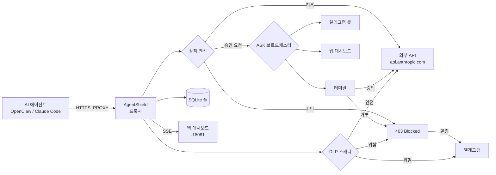

# AgentShield

**AI 에이전트를 위한 기본-차단 이그레스 방화벽**

[](../LICENSE)
[](https://github.com/kamuimk/agentshield/actions/workflows/ci.yml)
[](https://codecov.io/gh/kamuimk/agentshield)

**[English](../README.md)**

AgentShield는 AI 에이전트(OpenClaw, Claude Code 등)의 아웃바운드 HTTP/HTTPS 트래픽을 제어하는 투명 이그레스 방화벽입니다. TOML 기반 정책 규칙으로 허가되지 않은 요청을 차단하며, MITM 모드에서는 HTTPS 연결을 복호화하여 DLP 스캔을 수행할 수 있습니다.

## 아키텍처



## 빠른 시작

```bash
# 소스에서 빌드 (Rust 1.85+ 필요)
git clone https://github.com/kamuimk/agentshield.git
cd agentshield
cargo build --release

# 초기화
./target/release/agentshield init

# 정책 템플릿 적용
./target/release/agentshield policy template openclaw-default

# 프록시 시작
./target/release/agentshield start

# AI 에이전트에 프록시 설정
export HTTPS_PROXY=http://127.0.0.1:18080
```

### OpenClaw 연동 (Node.js)

```bash
# OpenClaw이 AgentShield 프록시를 사용하도록 자동 설정
agentshield integrate openclaw

# 프록시 설정 제거
agentshield integrate remove
```

## 정책 설정

`agentshield.toml` 파일로 정책을 정의합니다:

```toml
[proxy]
listen = "127.0.0.1:18080"
mode = "transparent"    # "transparent" (기본) 또는 "mitm"

[policy]
default = "deny"    # deny | allow | ask

# LLM API 허용 (와일드카드: *.anthropic.com은 모든 서브도메인 매칭)
[[policy.rules]]
name = "anthropic-api"
domains = ["*.anthropic.com"]
action = "allow"

# GitHub 읽기 허용, 쓰기는 승인 필요
[[policy.rules]]
name = "github-read"
domains = ["api.github.com"]
methods = ["GET"]
action = "allow"

[[policy.rules]]
name = "github-write"
domains = ["api.github.com"]
methods = ["POST", "PUT", "PATCH", "DELETE"]
action = "ask"

# 속도 제한: 60초당 최대 100건
[[policy.rules]]
name = "rate-limited-api"
domains = ["api.example.com"]
action = "allow"
[policy.rules.rate_limit]
max_requests = 100
window_secs = 60

# HTTP 요청에 대한 DLP 스캔 활성화
[dlp]
enabled = true

# 시스템 허용 목록: 내부 서비스 바이패스 (예: 알림 엔드포인트)
# [system]
# allowlist = ["api.telegram.org"]

# 알림: deny/DLP 이벤트 발생 시 텔레그램 알림
# [notification]
# enabled = true
# [notification.telegram]
# bot_token = "${AGENTSHIELD_TELEGRAM_TOKEN}"
# chat_id = "${AGENTSHIELD_TELEGRAM_CHAT_ID}"
# events = ["deny", "dlp"]

# 웹 대시보드: 실시간 로그, 정책 편집, ASK 승인
[web]
enabled = true
listen = "127.0.0.1:18081"
```

### 정책 액션

| 액션 | 동작 |
|------|------|
| `allow` | 요청 통과, SQLite에 로그 기록 |
| `deny` | `403 Forbidden` + `X-AgentShield-Reason` 헤더로 차단 |
| `ask` | 터미널/텔레그램/웹에서 승인 요청. 타임아웃(30초) 시 기본 차단 |
| `allow` + `rate_limit` | 설정된 한도까지 허용; 초과 시 `429 Too Many Requests` |

### 대화형 ASK 프롬프트

`ask` 규칙에 매칭된 요청이 오면, AgentShield는 4가지 옵션을 제공합니다:

| 키 | 동작 |
|----|------|
| `a` | **1회 허용** — 이 요청만 허용 |
| `r` | **규칙 추가** — 설정 파일에 영구 허용 규칙 자동 생성 |
| `d` | **거부** — 요청 차단 |
| `i` | **검사** — 요청 페이로드 확인(4KB 잘림) 후 재결정 |

알 수 없는 입력은 기본적으로 거부(fail-closed). ASK 요청은 모든 활성 채널(터미널, 텔레그램, 웹 대시보드)에 동시 브로드캐스트되며, 첫 번째 응답이 적용됩니다.

### 와일드카드 도메인 매칭

| 패턴 | 매칭됨 | 매칭 안 됨 |
|------|--------|------------|
| `api.github.com` | `api.github.com` | `sub.api.github.com` |
| `*.github.com` | `api.github.com`, `github.com`, `deep.api.github.com` | `evil-github.com` |
| `*` | 모든 도메인 | — |

와일드카드는 `[[policy.rules]]`의 domains와 `[system] allowlist` 모두에서 사용 가능합니다.

### 환경 변수 치환

`agentshield.toml`에서 `${VAR_NAME}` 또는 `$VAR_NAME` 문법으로 환경 변수를 참조할 수 있습니다. 설정 파일에 비밀 값을 직접 넣지 않아도 됩니다:

```toml
[notification.telegram]
bot_token = "${AGENTSHIELD_TELEGRAM_TOKEN}"
chat_id = "${AGENTSHIELD_TELEGRAM_CHAT_ID}"
```

누락된 변수는 시작 시 명확한 에러 메시지를 출력합니다.

### 시스템 허용 목록

`[system] allowlist`의 도메인은 정책 평가 **및** DLP 스캔을 완전히 바이패스합니다. 프록시가 자체 알림 트래픽을 차단하는 것을 방지합니다.

```toml
[system]
allowlist = ["api.telegram.org"]
```

> **보안 경고:** 허용 목록의 도메인은 **모든** 보호(정책 + DLP)를 바이패스합니다. 신뢰할 수 있는 내부 서비스만 추가하세요. 외부 도메인을 추가하면 해당 목적지에 대한 아웃바운드 보호가 비활성화됩니다.

### 알림

AgentShield는 요청이 거부되거나 DLP 탐지가 발생하면 텔레그램으로 알림을 보낼 수 있습니다. 알림은 fire-and-forget 방식으로, 실패해도 프록시를 차단하지 않습니다.

```toml
[notification]
enabled = true

[notification.telegram]
bot_token = "${AGENTSHIELD_TELEGRAM_TOKEN}"
chat_id = "${AGENTSHIELD_TELEGRAM_CHAT_ID}"
events = ["deny", "dlp"]
```

`events` 필드로 알림을 트리거할 이벤트 유형을 필터링합니다:

| 이벤트 유형 | 설명 |
|-------------|------|
| `deny` | 정책에 의해 요청 차단 |
| `dlp` | DLP 스캐너가 민감 데이터 감지 |
| `ask` | 대화형 승인 대기 중인 요청 |
| `rate-limited` | 속도 제한에 의해 요청 차단 |
| `start` | 프록시 서버 시작 |
| `shutdown` | 프록시 서버 종료 |

`events`가 비어있거나 생략되면 모든 이벤트 유형이 전달됩니다(하위 호환).

#### 텔레그램 대화형 ASK

텔레그램 인라인 키보드를 통한 양방향 ASK 승인:

```toml
[notification.telegram]
bot_token = "${AGENTSHIELD_TELEGRAM_TOKEN}"
chat_id = "${AGENTSHIELD_TELEGRAM_CHAT_ID}"
interactive = true  # ASK 승인용 인라인 키보드 활성화
```

`interactive = true`이면 ASK 요청이 허용/거부 버튼이 있는 텔레그램 메시지로 나타납니다.

### 웹 대시보드

AgentShield에는 실시간 모니터링 및 ASK 승인을 위한 내장 웹 대시보드가 포함되어 있습니다:

```toml
[web]
enabled = true
listen = "127.0.0.1:18081"  # 기본값
auth_token = "${AGENTSHIELD_WEB_TOKEN}"  # 선택사항: API 인증용 Bearer 토큰
```

브라우저에서 `http://127.0.0.1:18081`을 열거나 `agentshield dashboard`를 실행하여 접근:

- **실시간 로그** — SSE(Server-Sent Events)를 통한 실시간 요청 스트림
- **통계** — 총 요청, 허용, 거부, ASK, 시스템 허용, 속도 제한 카운트
- **정책 편집기** — JSON으로 정책 규칙 보기 및 편집
- **ASK 승인** — 브라우저에서 대기 중인 ASK 요청 승인 또는 거부

#### 인증

`auth_token`이 설정되면 모든 `/api/*` 엔드포인트에 Bearer 토큰이 필요합니다. 대시보드 페이지(`/`)는 항상 공개입니다.

```bash
# 헤더를 통해
curl -H "Authorization: Bearer <토큰>" http://127.0.0.1:18081/api/status

# 쿼리 파라미터를 통해 (SSE/EventSource용)
curl http://127.0.0.1:18081/api/logs/stream?token=<토큰>
```

#### REST API 엔드포인트

| 메서드 | 경로 | 설명 |
|--------|------|------|
| `GET` | `/api/logs?limit=50` | 최근 요청 로그 |
| `GET` | `/api/logs/stream` | SSE 실시간 로그 스트림 |
| `GET` | `/api/status` | 요청 통계 |
| `GET` | `/api/policy` | 현재 정책 (JSON) |
| `PUT` | `/api/policy` | 정책 규칙 업데이트 |
| `GET` | `/api/ask/pending` | 대기 중인 ASK 요청 |
| `GET` | `/api/ask/stream` | SSE ASK 이벤트 스트림 |
| `POST` | `/api/ask/:id/allow` | 대기 중인 ASK 승인 |
| `POST` | `/api/ask/:id/deny` | 대기 중인 ASK 거부 |

### MITM 모드 (TLS 인터셉션)

MITM 모드는 DLP 스캔을 위해 HTTPS 트래픽을 복호화합니다. 로컬 Root CA가 필요합니다:

```bash
# Root CA 생성
agentshield ca init

# 시스템 신뢰 저장소에 CA 설치 (안내 출력)
agentshield ca trust

# 인증서 핑거프린트 표시
agentshield ca show

# 다른 머신용 인증서 내보내기
agentshield ca export /path/to/exported.pem
```

설정에서 MITM 활성화:

```toml
[proxy]
listen = "127.0.0.1:18080"
mode = "mitm"
ca_dir = "~/.agentshield/ca"
```

MITM 모드에서:
- HTTPS CONNECT 요청이 복호화되어 DLP 검사 후 재암호화됩니다
- 시스템 허용 목록의 도메인은 MITM을 바이패스합니다 (일반 터널, 복호화 없음)
- 정책에 의해 거부된 도메인은 TLS 핸드셰이크 전에 차단됩니다
- 도메인별 인증서가 동적으로 생성되고 캐시됩니다 (LRU, 최대 1000개)

Node.js 애플리케이션에서 AgentShield CA를 신뢰하려면 `NODE_EXTRA_CA_CERTS`를 설정하세요:

```bash
export NODE_EXTRA_CA_CERTS=~/.agentshield/ca/cert.pem
```

### 정책 핫 리로드

프록시를 재시작하지 않고 정책 규칙이 자동으로 리로드됩니다:

- **파일 감시** — `agentshield.toml` 변경 사항이 감지되어 즉시 적용
- **SIGHUP 시그널** — `kill -HUP <pid>`로 수동 리로드 트리거

잘못된 설정 변경은 안전하게 무시됩니다 (이전 정책이 유지됨).

### 속도 제한

도메인별 슬라이딩 윈도우 속도 제한으로 과도한 API 호출을 방지합니다:

```toml
[[policy.rules]]
name = "rate-limited-api"
domains = ["api.example.com"]
action = "allow"
[policy.rules.rate_limit]
max_requests = 100    # 최대 허용 요청 수
window_secs = 60      # 시간 윈도우 (초)
```

도메인이 한도를 초과하면 프록시는 `429 Too Many Requests`를 반환합니다. 속도 제한된 요청은 로그에 기록되고 `agentshield status`에서 카운트됩니다.

### DLP (데이터 유출 방지)

`[dlp] enabled = true`이면, AgentShield가 HTTP 요청 본문에서 민감 데이터를 스캔합니다:

| 심각도 | 패턴 | 조치 |
|--------|------|------|
| Critical | OpenAI, Anthropic, Google AI, HuggingFace, Cohere, Replicate, Mistral, Groq, Together AI, Fireworks AI API 키, AWS 액세스 키, 프라이빗 키, GitHub 토큰 | 차단 (403) |
| High | 일반 API 키 | 경고 로그, 허용 |
| Medium | 이메일 주소 | 경고 로그, 허용 |

> **참고:** transparent 모드에서 CONNECT 터널(HTTPS)은 암호화되어 DLP 스캔이 불가합니다. HTTPS 트래픽에 DLP를 활성화하려면 MITM 모드를 사용하세요.

### 내장 템플릿

| 템플릿 | 설명 |
|--------|------|
| `openclaw-default` | OpenClaw 게이트웨이 기본값: LLM API, 메시징, GitHub, npm |
| `claude-code-default` | Claude Code 기본값 |
| `strict` | 모든 트래픽 차단 (빈 슬레이트) |

```bash
agentshield policy template openclaw-default
```

## CLI 명령어

```
agentshield init                      # 설정 + 데이터베이스 초기화
agentshield start [--daemon]          # 프록시 시작
agentshield stop                      # 프록시 중지
agentshield status                    # 요청 통계 표시
agentshield logs [--tail N]           # 최근 로그 보기
agentshield logs --export --format json  # 로그 내보내기
agentshield policy show               # 현재 정책 표시
agentshield policy template <이름>    # 템플릿 적용
agentshield integrate openclaw        # OpenClaw 프록시 설정
agentshield integrate remove          # 프록시 설정 제거
agentshield dashboard                 # 웹 대시보드 열기
agentshield ca init                   # MITM용 Root CA 생성
agentshield ca trust                  # 시스템 신뢰 저장소 설치 안내
agentshield ca show                   # CA 인증서 정보 표시
agentshield ca export <경로>          # CA 인증서 내보내기
```

## Docker

AgentShield는 멀티 플랫폼 Docker 이미지(amd64/arm64)를 제공합니다:

```bash
# 로컬 빌드
docker build -t agentshield .

# 설정과 함께 실행
docker run -v ./agentshield.toml:/etc/agentshield/agentshield.toml \
  -p 18080:18080 -p 18081:18081 \
  agentshield start --config /etc/agentshield/agentshield.toml
```

태그 릴리즈마다 `ghcr.io`에 사전 빌드된 이미지가 게시됩니다.

### Docker Compose 사용 (OpenClaw)

```yaml
# docker-compose.yml
services:
  agentshield:
    image: ghcr.io/kamuimk/agentshield:latest
    ports:
      - "18080:18080"
      - "18081:18081"
    volumes:
      - ./agentshield.toml:/etc/agentshield/agentshield.toml
    command: ["start", "--config", "/etc/agentshield/agentshield.toml"]

  openclaw-gateway:
    environment:
      HTTP_PROXY: http://agentshield:18080
      HTTPS_PROXY: http://agentshield:18080
      NO_PROXY: localhost,127.0.0.1
```

호스트에서 AgentShield를 실행하는 경우(Docker 아님), `host.docker.internal:18080`을 사용하고 `0.0.0.0:18080`에서 리슨하세요.

> **참고:** Node.js 23은 `HTTP_PROXY` / `HTTPS_PROXY` 환경 변수를 기본 지원하지 않습니다. 프록시 에이전트 라이브러리(예: `undici`)를 사용하거나 `NODE_USE_ENV_PROXY=1`을 지원하는 Node.js 24+를 기다려야 할 수 있습니다.

## AgentShield가 아닌 것

- **샌드박스가 아닙니다.** AgentShield는 네트워크 이그레스만 제어합니다. 파일 시스템 접근, 프로세스 실행 또는 기타 로컬 작업은 제한하지 않습니다.
- **프롬프트 인젝션 방어가 아닙니다.** 네트워크 계층에서 작동하며, LLM 계층이 아닙니다.
- **WAF가 아닙니다.** 이그레스 방화벽이며, 인그레스 방화벽이 아닙니다. 데이터 유출을 방지하며, 들어오는 공격을 방어하지 않습니다.

AgentShield는 [PipeLock](https://github.com/nichochar/pipelock) (코드 실행 샌드박싱)이나 [LlamaFirewall](https://github.com/meta-llama/PurpleLlama) (프롬프트 수준 방어)와 같은 도구를 보완합니다.

## 개발

- **MSRV:** Rust 1.85 (edition 2024)

```bash
cargo test --all     # 전체 테스트 실행 (292개)
cargo clippy         # 린트
cargo fmt            # 포맷
```

## 라이선스

[Apache License 2.0](../LICENSE)
